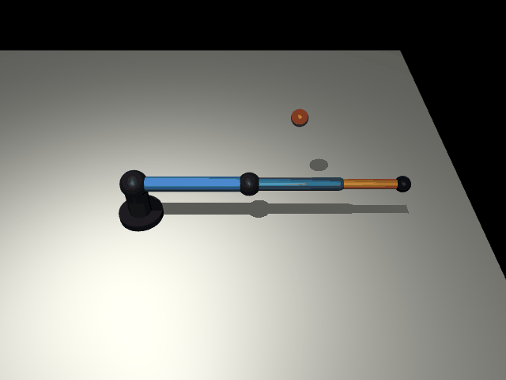

# 3D 3-DOF MuJoCo Kinematics and PID Demo



This project demonstrates forward kinematics, inverse kinematics, and PID
control for a 3D robot arm. It is built for a computer project, so the code is
kept small, direct, and easy to explain.

The robot has three revolute joints:

```text
q1 = base yaw about the z-axis
q2 = shoulder pitch
q3 = elbow pitch
```

These three joints control the end-effector position `[x, y, z]`. They do not
control full 3D orientation; that would require more degrees of freedom.

## Setup

On Ubuntu, install Tkinter first:

```bash
sudo apt install python3-tk
```

Set up the project:

```bash
./setup.sh
```

Run the project:

```bash
./run.sh
```

Run tests:

```bash
.venv/bin/python -m pytest
```

Manual fallback:

```bash
python3 -m venv .venv
.venv/bin/python -m pip install -r requirements.txt
.venv/bin/python main.py
```

## Project Structure

```text
main.py                    starts the app
setup.sh                   creates .venv and installs dependencies
run.sh                     starts the app from .venv
config.py                  link lengths, limits, PID defaults, and UI constants
ui/app.py                  main Tkinter coordinator and callbacks
ui/widgets.py              reusable dark UI widgets and equation panels
ui/forward_tab.py          Forward Kinematics tab layout
ui/inverse_tab.py          Inverse Kinematics tab layout
ui/pid_tab.py              PID Control tab layout and live plot
kinematics/forward.py      forward kinematics, robot points, and Jacobian
kinematics/inverse.py      inverse kinematics and safety checks
control/pid.py             joint-space PID controller and plot history
simulation/mujoco_sim.py   MuJoCo XML model, viewer, reset, and stepping logic
tests/                     tests for math, controller, UI helpers, and MuJoCo
REPORT.md                  project explanation and math derivation
```

## How To Use The App

1. Click `Open MuJoCo Viewer` to show the 3D robot.
2. In direct mode, use the `Forward Kinematics` sliders or input boxes to move yaw, shoulder, and elbow live.
3. Turn on `Use PID Motion` when you want FK or IK targets to move smoothly with PID instead of teleporting.
4. With PID motion enabled, the `Apply FK Target` button appears; click it to start smooth PID motion toward the FK angles.
5. In `Inverse Kinematics`, target sliders only move the red marker; click `Solve IK`, then `Apply Solution`.
6. Use the `PID Control` tab as a live controller with target inputs, gain inputs, live values, and the response plot.

The app uses a dark `ttk` interface with scrollable tabs so the controls stay
usable on smaller screens. The FK and IK tabs show equations rendered with
Matplotlib mathtext inside Tkinter. The PID tab shows current/target/error
values, plus joint error norm and torque norm over time. In direct mode, the FK
apply button is hidden because FK sliders and input boxes already move the
robot live.

All user inputs have sliders and matching numeric input boxes. Invalid typed
values are restored, and out-of-range values are clamped safely.

The app blocks unnatural demo poses:

```text
q1 yaw:      -180 deg to 180 deg
q2 shoulder:   0 deg to 110 deg
q3 elbow:   -135 deg to 0 deg
```

Moving robot points must also stay at least `0.02 m` above the floor. If a
slider or IK target would violate those rules, the app rejects it and shows a
status message.

## Core Math

The link lengths are:

```text
L1 = 0.45 m
L2 = 0.35 m
L3 = 0.25 m
```

The shoulder is raised above the floor by:

```text
base_height = 0.18 m
```

Forward kinematics:

```text
r = L1*cos(q2) + (L2 + L3)*cos(q2 + q3)
x = r*cos(q1)
y = r*sin(q1)
z = base_height + L1*sin(q2) + (L2 + L3)*sin(q2 + q3)
```

Inverse kinematics uses damped least squares:

```text
position_error = target_position - current_position
dq = alpha * J.T * inv(J*J.T + lambda^2*I) * position_error
```

Before the numerical refinement starts, the solver chooses the cleaner
elevated-elbow branch from the two geometric IK candidates. That keeps the
demo from picking a technically valid but visually confusing downward-shoulder
solution.

PID control uses:

```text
torque = Kp*error + Ki*integral(error) + Kd*derivative(error)
```

When `Use PID Motion` is enabled, FK and IK apply actions start PID motion
toward the target. When it is disabled, FK and IK apply actions set the robot
pose directly. MuJoCo gravity is enabled during PID stepping so the controller
has to hold the arm against weight, then disabled again for direct FK/IK
positioning.

## How To Read The Code

Start with `kinematics/forward.py`. It has no GUI or MuJoCo code, only the
forward equations:

- `forward_kinematics()` computes `[x, y, z]` from joint angles.
- `jacobian()` computes how small joint changes affect position.

Then read `kinematics/inverse.py`:

- `inverse_kinematics()` repeatedly uses the Jacobian to move toward a target.

Then read `control/pid.py`. It has `PIDController`, which converts joint angle
error into motor torque, and `PIDHistory`, which stores plot samples.

Then read `simulation/mujoco_sim.py`. It owns the MuJoCo model, data, viewer,
and the small `after()`-driven simulation steps.

Finally read `ui/app.py` and the three files in `ui/*_tab.py`. They connect
Tkinter inputs, displayed equations, simulation actions, and status messages.

## Notes

- MuJoCo opens in a separate viewer window.
- Gravity is disabled for direct kinematics and enabled during PID motion.
- If the viewer does not open, check your display/OpenGL setup.
- If the app says Tkinter is missing, install `python3-tk`.

References:

- MuJoCo Python docs: https://mujoco.readthedocs.io/en/stable/python.html
- MuJoCo PyPI: https://pypi.org/project/mujoco/
